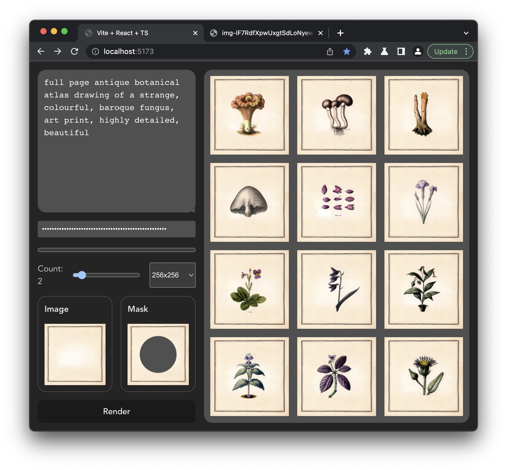

> This repository contains a bare-bones GUI for Dall·e 2 in-paint API.

## Why should I use this instead of the official editor (Nov '22)?

> #TL;DR: You probably shouldn't!

### The reason I set it up is that:

- 👍 it's cheaper and faster to use than the official editor
- 👍 no need to buy credits, just pay as you go
- 👎 it's limited (only image editing with masks)
- 👎 it's bare-bones (error messages are crude)

## How to

1. get your OpenAI API key
2. paste it in the editor
3. upload your base image and the mask

### Is it safe to paste my API key here?

Yeah, the API key is stored in `localStorage`, so I don't see it. Feel free to fork and self host if you want to be super-duper-sure.
